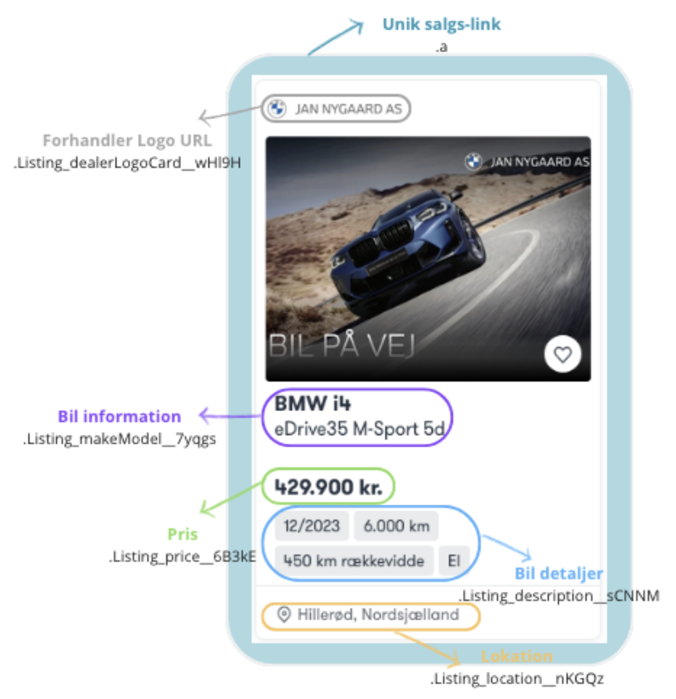

# Bilbasen Webscraper

## Oversigt
Denne scraper henter brugtbil-data fra **Bilbasen.dk** og **en tysk bilside** for at sammenligne priser på samme modeller i Danmark og Tyskland.  
Løsningen håndterer flere sider, dynamisk indhold og inkluderer **databehandling, rensning og SQL-lagring**.

## Strukturel opbygning
Webscraperen er designet som en **tre-trins proces**:

1. **Scrape af biloplysninger og forhandlerdata**  
   - Henter pris, model, kilometerstand, placering og rækkevidde for hver bilannonce.  
   - Scraper forhandleroplysninger såsom **navn, adresse, CVR-nummer og logo-URL**.  
   - Data hentes fra både Bilbasen og en tysk bilside for sammenligning af priser.  

2. **Data-rensning og lagring**  
   - Duplikat-check baseret på unikke bil-ID'er.  
   - Fjernelse af unødige tegn og formatfejl i beskrivelser og specifikationer.  

3. **Lagring i SQL**  
   - Automatiseret indsættelse i en **MariaDB-database**.  
   - Prisforskelle mellem Danmark og Tyskland beregnes og gemmes.  

### Webscraping 
Scraperen er opbygget med et **to-delt loop**, der sikrer en systematisk gennemgang af alle biler:

- **Ydre loop:** Itererer gennem alle sider på Bilbasen og den tyske bilside.
- **Indre loop:** Gennemgår hver bilannonce på en given side og ekstraherer detaljer.

Hver bilannonce identificeres som et unikt `<article>`-element, hvilket sikrer præcis dataindsamling:  

For at hente specifikke oplysninger anvendes **CSS-selectors**, der identificerer nøgledata såsom pris, model og rækkevidde.  
Eksempel på datafelter, der ekstraheres fra hver annonce:  

Eksempel på scraping af forhandlerdata:  

### SQL-lagring
- Data gemmes i en **MariaDB-database** for struktureret lagring og nem adgang.
- **RMySQL/RMariaDB** bruges til at skrive data direkte til SQL-tabeller.
- Automatiseret **duplikat-check** sikrer, at kun nye biler indsættes i databasen.
- Data kan hentes, opdateres og analyseres direkte fra SQL via forespørgsler.
